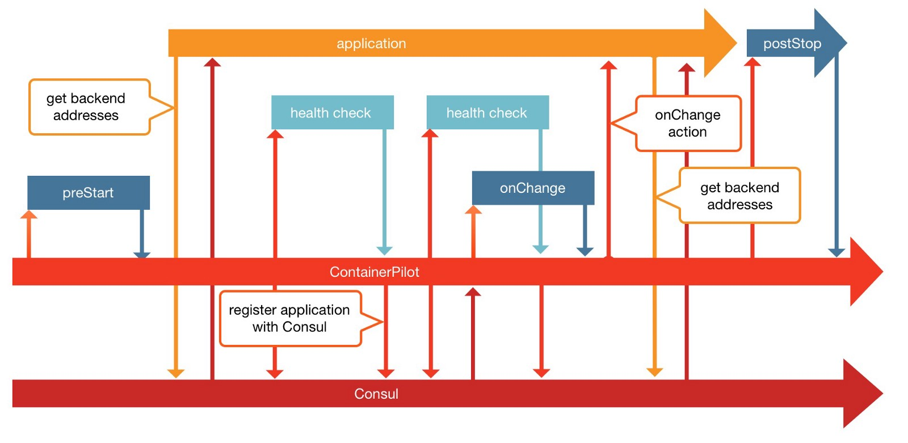
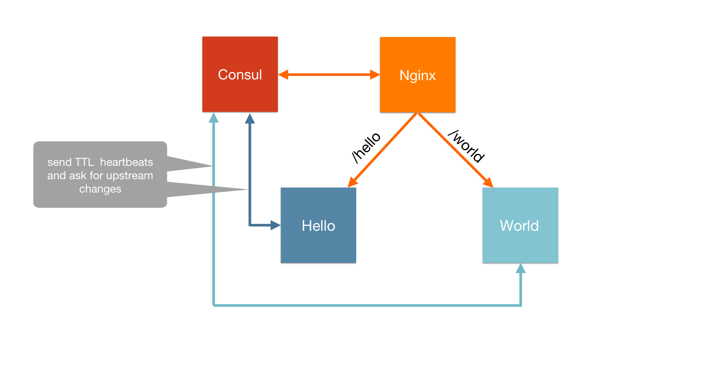

# Joyent's ContainerPilot Pattern Example Using Node.JS service

## Overview

Autopilot pattern moves all the orchestration responsibilities to the application itself rather than relying on an external orchestrator. So what is orachestration? Orchestration is the automation of the operations of an application. Most application require operational tasks like connecting them to related components (joyent-helloworld), and some applications require special attention as they start up or shut down to be sure they bootstrap correctly or persist their data.

So what is ContainerPilot? **ContainerPilot** will be added to each of the application’s service. It communicates with the application’s service on one side and with Consul on the other side. It takes following responsibilities:
1. the service registration within Consul
2. defining how the health check of the service needs to be done
3. defining the dependencies of the current service
4. the management of the service workflow by calling configuration script for preStart / onChange / postStop actions

The application is divided into 4 parts:

1. **nginx** - nginx server rendering static assets
2. **consul** - service registry & catalog used to keep track of registered services
3. **hello** - Node.js service responding with the word "Hello"
4. **world** - Node.js service responding with the word "World"

## Instructions to run

1. `git clone git@github.com:joyent-helloworld.git`
2. `cd hello-world`
3. `docker-compose up -d`
4. `open http://localhost`
