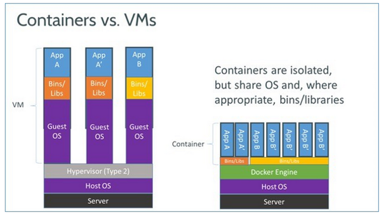
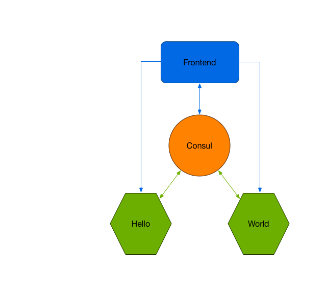

# Joyent's ContainerPilot Pattern Example Using Node.JS Services

## Overview

This project will explore how to build [12 factor app](https://12factor.net) using Container Pilot pattern i.e. seamless service registry, discovery etc etc

Autopilot pattern moves all the orchestration responsibilities to the application itself rather than relying on an external orchestrator. **So what is orachestration? Orchestration** is the automation of the operations of an application. Most application require operational tasks like connecting them to related components (joyent-helloworld), and some applications require special attention as they start up or shut down to be sure they bootstrap correctly or persist their data.

**So what is ContainerPilot? ContainerPilot** is added to application’s service. It communicates with the application’s service on one hand and with Consul on the other hand. It takes following key responsibilities:
1. _the service registration/discovery within Consul_
2. _defining how the health check of the service needs to be done_
3. _defining the dependencies of the current service_
4. _the management of the service workflow by calling configuration script for preStart / onChange / postStop actions_

Following picture picotorially depicts Container Pilot pattern:

## Joyent Containers

Before going in the direction of Joyent containerization, let refresh the differences between container vs vm as shown below :

Joyent containers can be categorized into following:

**Option 1.** _Infrastructure containers running container-native Linux and SmartOS that work like a typical Unix host._

**Option 2.** _Docker containers running Docker images._

**Option 3.** _Containers hosting hardware virtual machines running Windows, FreeBSD, or others. These don't offer the same performance advantages, but they offer compatibility for workloads that can't be fully containerized._

Following table show KPI of container provider by diffrent cloud providers:

| Instance Type                         | EC2 t2.micro           | Triton G4 standard 128M  |
| ------------------------------------- |:----------------------:| ------------------------:|
| Cloud Provider                        | AWS                    |  Joyent                  |
| Memory                                | 1GB                    |   128 M                  |
| CPU shares/cores (with hyperthreading)| 0.1                    |   0.125                  |

For more details & comparision container hosted on different cloud provider refer to [blog](https://www.joyent.com/blog/understanding-triton-containers)

As can be concluded from above, Option 1 & Option 2 are the most high performtant containerization provided by Joyent.

## Application Architecture
The application is divided into 4 parts:

1. _**nginx**_ - nginx server rendering static assets
2. _**consul**_ - service registry & catalog used to keep track of registered services
3. _**hello**_ - Node.js service responding with the word "Hello"
4. _**world**_ - Node.js service responding with the word "World"

Following pictures shows complete architecture diagram:

## Instructions to run

1. `git clone git@github.com:joyent-helloworld.git`
2. `cd hello-world`
3. `docker-compose up -d`
4. `open http://localhost`

The fun part now, this application can be scaled by issuing following command:

`docker-compose scale hello=10 world=6`

## Conclusions
Container pilot is an awsome patten to address loads operation concerns to name the few, rolling restart, graceful shutdown etc implemented as infrastructure as code, handled from within application, rather than some god father orchestrator somewhere - **welcome to the elegant world of "devops", "full stack developer", ...**
